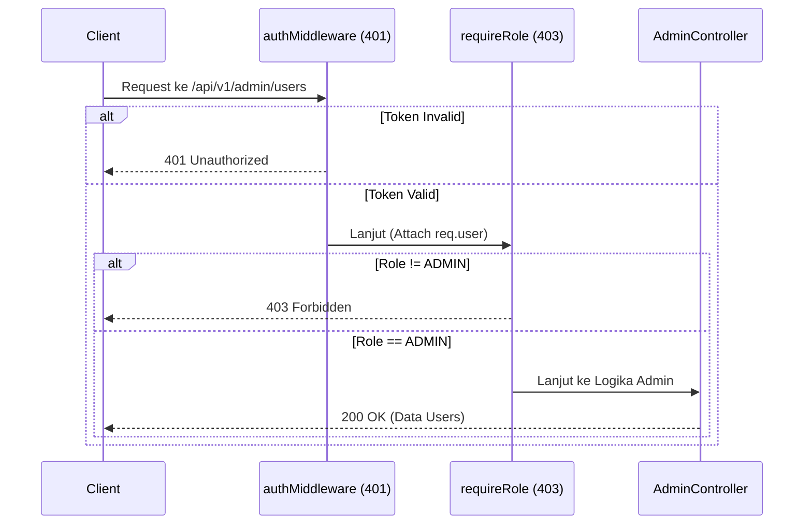

# Artefak Rencana Implementasi: Sistem Keamanan & RBAC (Sesi 5)

## Tujuan Utama
Fokus pada pemisahan tanggung jawab antara User biasa dan Admin untuk mencegah eksploitasi data (Privilege Escalation).

## Tahapan Implementasi

### 1. Tahap Infrastruktur (Shared Middleware)
**Tujuan:** Menciptakan "Alat Deteksi Role" yang bisa digunakan di rute mana pun.

**Aksi:**
- Membuat file `src/shared/middleware/role-middleware.ts`
- Logika: Fungsi `requireRole(...roles)` yang memeriksa rincian `req.user.role`
- Jika role tidak sesuai, kirim 403 Forbidden

**Hasil:** Dapat menggunakan `requireRole('ADMIN')` atau `requireRole('ADMIN', 'SUPER_ADMIN')` dengan mudah.

### 2. Tahap Pembersihan Fitur User (`src/features/user`)
**Masalah:** Saat ini rute user masih memiliki fitur admin (seperti hapus user berdasarkan ID).

**Aksi:** Refactor agar lebih aman dengan membatasi `user.routes.ts` hanya untuk Profile pribadi.

**Target Endpoint:**
- `GET /me`: Melihat profil sendiri
- `PATCH /me`: Update profil sendiri
- Hapus: `DELETE /api/v1/user/` (seluruh list) dan `POST /api/v1/user/` (tambah user) akan dihapus dari sini

### 3. Tahap Pembuatan Fitur Admin (`src/features/admin`)
**Konsep:** "Benteng Eksklusif" yang hanya bisa dimasuki oleh user dengan role: ADMIN.

**Aksi:**
- Membuat folder baru `src/features/admin`
- Setup Keamanan: Memasang `requireRole('ADMIN')` di tingkat paling atas router Admin

**Target Endpoint Baru:**
- `GET /api/v1/admin/users`: List seluruh user (dengan filter & pagination)
- `GET /api/v1/admin/stats`: Melihat statistik sistem (total user, user aktif, dll)
- `PATCH /api/v1/admin/users/:id/role`: Mengubah role user lain
- `DELETE /api/v1/admin/users/:id`: Menghapus user secara permanen dari sistem

### 4. Tahap Integrasi Global (`src/server.ts`)
**Aksi:** Mendaftarkan `adminRouter` ke aplikasi utama.

**Endpoint Prefix:** `/api/v1/admin`

## Estimasi Perubahan File

| Nama File | Perubahan Utama |
|-----------|-----------------|
| `src/shared/middleware/role-middleware.ts` | (Baru) Logika pengecekan role |
| `src/features/admin/*` | (Baru) Semua file logic khusus admin |
| `src/features/user/user.routes.ts` | (Edit) Menghapus rute manajemen user global |
| `src/server.ts` | (Edit) Registrasi routing admin |

## Diagram Alur Akses Admin

## Prasyarat
- Memahami struktur codebase dari AGENTS.md
- Pastikan role sudah ada di model User (Prisma schema)
- Jalankan linting dan typecheck setelah perubahan

## Verifikasi Implementasi
- Test endpoint admin dengan user biasa (harus 403)
- Test endpoint admin dengan user ADMIN (harus 200)
- Test endpoint user pribadi tetap berfungsi